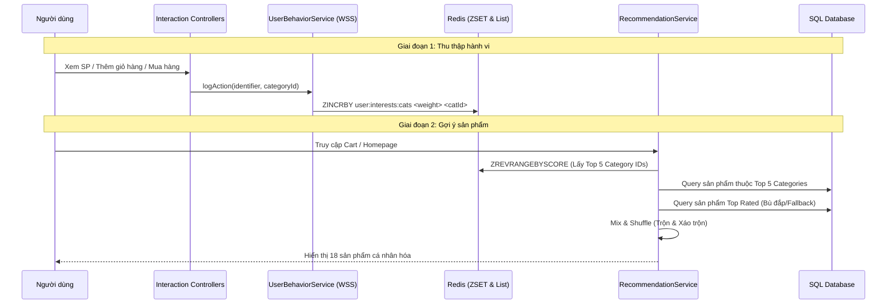
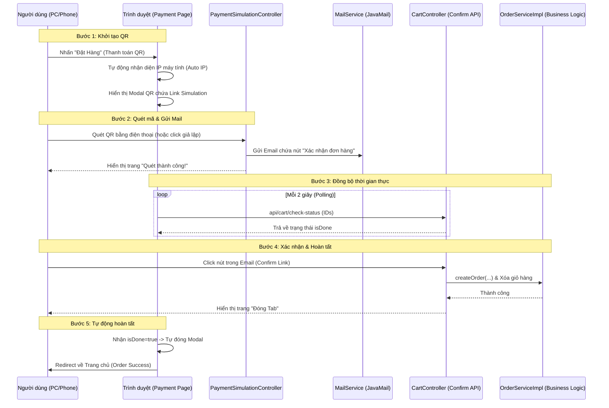

# S-Mall: Luồng Chạy Tính Năng (Feature Flow Documentation)

Tài liệu này mô tả các luồng xử lý kỹ thuật cho các tính năng chính của dự án S-Mall.

---

## 1. Hệ thống Gợi ý Cá nhân hóa (AI Recommendation Engine)

Hệ thống sử dụng mô hình **Hybrid Recommendation** kết hợp hành vi người dùng thời gian thực và dữ liệu phổ biến.

### Sơ đồ Luồng (Sequence Diagram)

### Trọng số Điểm tiềm năng (Weighted Scoring)
| Hành động | Trọng số | Ghi chú |
| :--- | :--- | :--- |
| Xem chi tiết (View) | +1 | Quan tâm mức độ thấp |
| Tìm kiếm (Search) | +2 | Có chủ đích tìm kiếm |
| Thêm vào giỏ (Cart) | +5 | Quan tâm mức độ cao |
| Mua hàng (Purchase) | +10 | Chuyển đổi thành công |

---

## 2. Luồng Xử lý Giỏ hàng (Cart Persistence Flow)

Sử dụng Redis làm bộ lưu trữ chính để đảm bảo tốc độ và khả năng mở rộng.

### Quy trình nghiệp vụ:
1.  **Định danh (Identification)**: Sử dụng `username` (nếu đã login) hoặc `sessionId` (nếu vãng lai).
2.  **Lưu trữ**: Dữ liệu lưu tại Redis với key `cart_v2:{identifier}`.
3.  **Xử lý Serialization**: 
    - Lưu dưới dạng JSON thuần túy (Plain JSON).
    - Khi đọc lên, nếu là `LinkedHashMap`, hệ thống sử dụng `ObjectMapper.convertValue` để ánh xạ về `CartDTO` một cách an toàn.

---

## 3. Luồng Bảo mật & Chống Brute Force

Đảm bảo an toàn cho tài khoản người dùng thông qua Redis.

### Quy trình:
1.  **Theo dõi**: Mỗi lần login sai, tăng giá trị đếm tại `login:attempts:{username}` trong Redis.
2.  **Khóa (Lock)**: Nếu đếm đạt 5 lần, đặt TTL cho key là 30 phút.
3.  **Hành động**: 
    - Chặn mọi yêu cầu login tiếp theo trong thời gian khóa.
    - Gửi email cảnh báo bảo mật cho người dùng.
    - Hiển thị đồng hồ đếm ngược thời gian mở khóa trên giao diện.

---

## 4. Mô phỏng Thanh toán QR & Xác nhận Đơn hàng (Simulated QR Payment)

Hệ thống cung cấp quy trình thanh toán QR giả lập chuyên nghiệp, không kết nối ngân hàng thật nhưng đảm bảo trải nghiệm người dùng chân thực.

### Sơ đồ Luồng (Sequence Diagram)

### Các công nghệ & Giải pháp áp dụng:
1.  **Auto IP Detection**: Sử dụng `DatagramSocket` trong Java để tự động tìm IP nội bộ, giúp điện thoại quét được mã QR mà không cần cấu hình thủ công.
2.  **Idempotency (Tính nhất quán)**: Xử lý trường hợp người dùng nhấn link xác nhận nhiều lần mà không gây lỗi "Trống giỏ hàng".
3.  **Real-time Polling**: Trình duyệt tự động thăm dò trạng thái đơn hàng để đóng Modal QR ngay khi người dùng xác nhận trên thiết bị khác.
4.  **Seamless Experience**: Tab xác nhận từ Email tự động hiển thị hướng dẫn đóng tab để tập trung trải nghiệm vào Tab chính.
