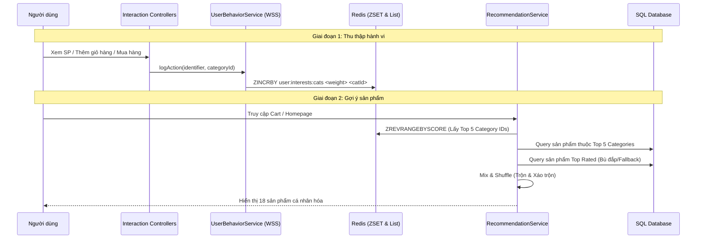
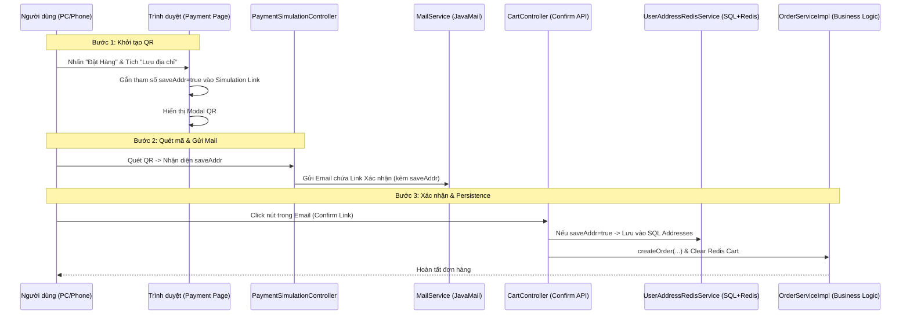
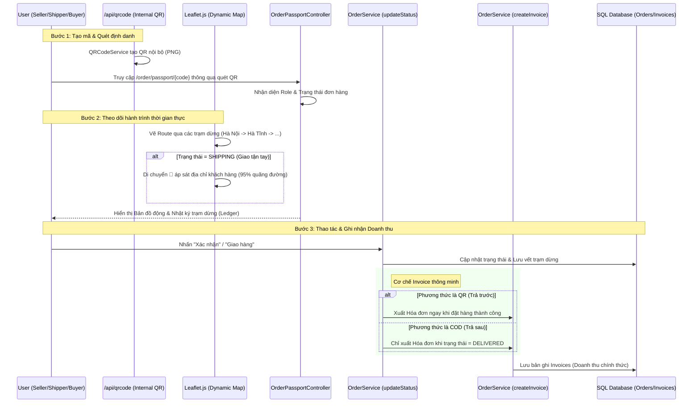
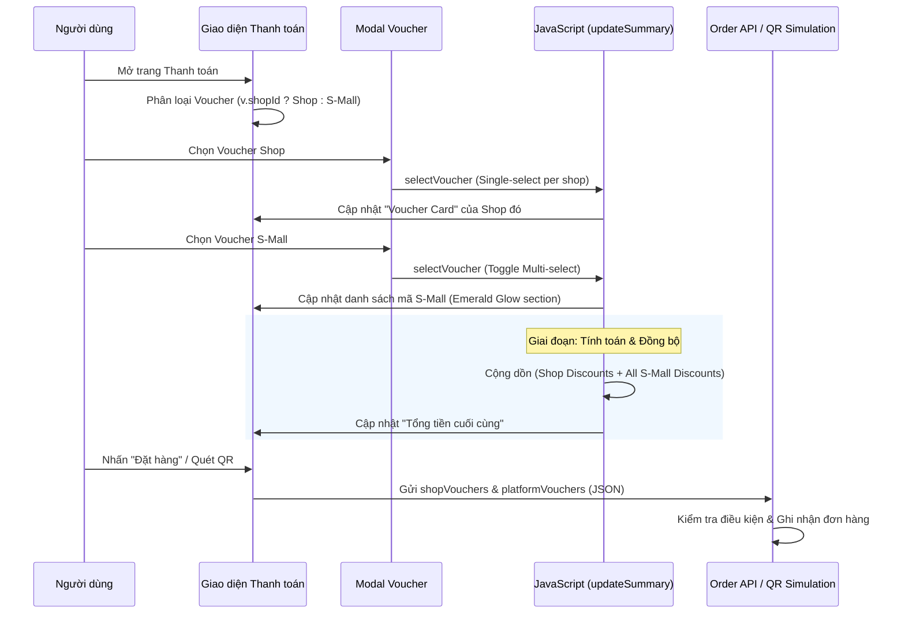
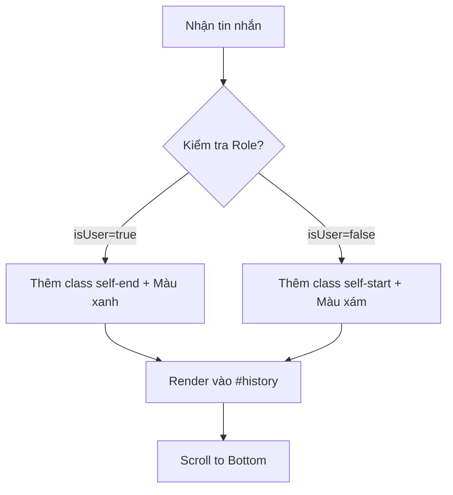
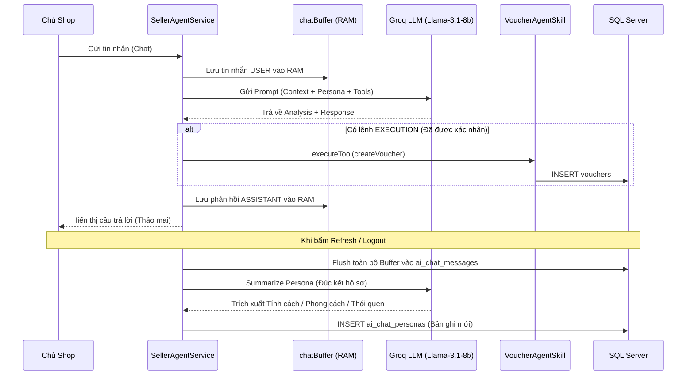
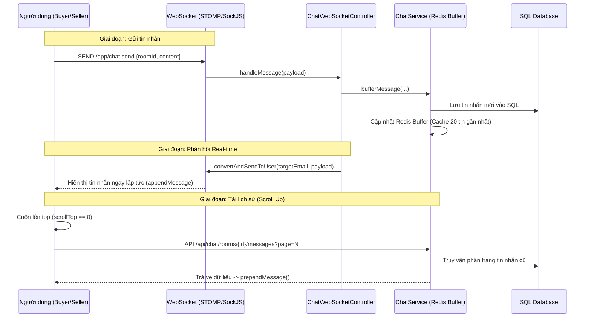

# S-Mall: Luồng Chạy Tính Năng (Feature Flow Documentation)

Tài liệu này mô tả các luồng xử lý kỹ thuật cho các tính năng chính của dự án S-Mall.

---

## 1. Hệ thống Gợi ý Cá nhân hóa (AI Recommendation Engine)

Hệ thống sử dụng mô hình **Hybrid Recommendation** kết hợp hành vi người dùng thời gian thực và dữ liệu phổ biến.

### Sơ đồ Luồng (Sequence Diagram)

### Trọng số Điểm tiềm năng (Weighted Scoring)
| Hành động | Trọng số | Ghi chú |
| :--- | :--- | :--- |
| Xem chi tiết (View) | +1 | Quan tâm mức độ thấp |
| Tìm kiếm (Search) | +2 | Có chủ đích tìm kiếm |
| Thêm vào giỏ (Cart) | +5 | Quan tâm mức độ cao |
| Mua hàng (Purchase) | +10 | Chuyển đổi thành công |

---

## 2. Hệ thống Lưu trữ Lai (Hybrid Persistence: SQL + Redis)

Hệ thống kết hợp sức mạnh của Redis (Tốc độ) và SQL (Bền bỉ) để đảm bảo dữ liệu không bao giờ bị mất ngay cả khi server bảo trì hoặc RAM bị xóa.

### Quy trình "Double-Write" (Ghi song song):
1.  **Thêm vào giỏ**: Hệ thống đồng thời lưu vào Redis (để lấy nhanh) và bảng `cart_items` trong SQL (để lưu trữ lâu dài).
2.  **Lưu địa chỉ**: Khi người dùng tích chọn "Lưu địa chỉ", thông tin sẽ được nạp vào Redis và bảng `addresses` (như một bản ghi lịch sử).

### Quản lý Vòng đời Dữ liệu (Lifecycle Management):
-   **Khi Đăng nhập (Sync on Login)**: `CustomAuthenticationSuccessHandler` kích hoạt lệnh nạp dữ liệu từ SQL lên Redis. Đảm bảo người dùng luôn thấy giỏ hàng của mình dù đổi thiết bị.
-   **Khi Đăng xuất (Purge on Logout)**: `CustomLogoutHandler` xóa sạch dữ liệu người dùng trên Redis để giải phóng RAM, nhưng vẫn giữ nguyên bản gốc trong SQL.

---

## 3. Luồng Quản lý Địa chỉ & Lịch sử Giao hàng

Hệ thống hỗ trợ lưu nhiều địa chỉ và cho phép người dùng chọn lại các địa chỉ đã từng sử dụng.

### Quy trình kỹ thuật:
1.  **Lưu trữ**: Địa chỉ được lưu vào bảng `addresses` (liên kết ManyToOne với User). Cột `address` trong `user_profiles` được giữ làm địa chỉ mặc định/gần nhất.
2.  **Truy xuất**: Tại trang thanh toán, hệ thống truy vấn tất cả địa chỉ cũ từ SQL và hiển thị thành danh sách gợi ý.
3.  **Tương tác**: Người dùng click vào địa chỉ gợi ý -> JavaScript tự động điền vào ô nhập liệu (Textarea).

---

## 4. Luồng Bảo mật & Chống Brute Force

Đảm bảo an toàn cho tài khoản người dùng thông qua Redis.

### Quy trình:
1.  **Theo dõi**: Mỗi lần login sai, tăng giá trị đếm tại `login:attempts:{username}` trong Redis.
2.  **Khóa (Lock)**: Nếu đếm đạt 5 lần, đặt TTL cho key là 30 phút.
3.  **Hành động**: 
    - Chặn mọi yêu cầu login tiếp theo trong thời gian khóa.
    - Gửi email cảnh báo bảo mật cho người dùng.
    - Hiển thị đồng hồ đếm ngược thời gian mở khóa trên giao diện.

---

## 5. Mô phỏng Thanh toán QR & Xác nhận Đơn hàng (Simulated QR Payment)

Hệ thống cung cấp quy trình thanh toán QR giả lập chuyên nghiệp, tích hợp đồng bộ dữ liệu địa chỉ.

### Sơ đồ Luồng (Sequence Diagram)

### Các công nghệ & Giải pháp áp dụng:
1.  **Auto IP Detection**: Sử dụng `DatagramSocket` trong Java để tự động tìm IP nội bộ, giúp điện thoại quét được mã QR mà không cần cấu hình thủ công.
2.  **Idempotency (Tính nhất quán)**: Xử lý trường hợp người dùng nhấn link xác nhận nhiều lần mà không gây lỗi "Trống giỏ hàng".
3.  **Real-time Polling**: Trình duyệt tự động thăm dò trạng thái đơn hàng để đóng Modal QR ngay khi người dùng xác nhận trên thiết bị khác.
4.  **Seamless Experience**: Tab xác nhận từ Email tự động hiển thị hướng dẫn đóng tab để tập trung trải nghiệm vào Tab chính.

---

## 6. Hệ thống Hộ chiếu Đơn hàng (Smart Order Passport) & Hóa đơn Tự động

Hệ thống quản lý vòng đời đơn hàng khép kín, tích hợp bản đồ vận chuyển thời gian thực và tự chủ công nghệ định danh QR.

### Sơ đồ Luồng Vận hành Passport:

### Các công nghệ & Giải pháp áp dụng:
1.  **Tự chủ công nghệ QR (Internal QR Engine)**: Triển khai API `/api/qrcode` sử dụng thư viện ZXing để tạo ảnh QR trực tiếp từ Server. Loại bỏ hoàn toàn sự phụ thuộc vào bên thứ ba, đảm bảo tính riêng tư và tốc độ tải cực nhanh.
2.  **Dynamic Route Visualization**: Sử dụng **Leaflet.js** để vẽ hành trình giao hàng. Hệ thống tự động tính toán tọa độ các trạm dừng trung chuyển và hiển thị vị trí mô phỏng của phương tiện vận chuyển dựa trên trạng thái đơn hàng.
3.  **Logistics Ledger (Nhật ký hành trình)**: Tự động ghi lại thời gian và địa điểm của từng bước xử lý (Xác nhận đơn, Xuất kho, Qua trạm trung chuyển, Giao hàng thành công) một cách minh bạch.
4.  **Revenue Recognition (Ghi nhận doanh thu)**: 
    - **Thanh toán QR**: Xuất hóa đơn ngay lập tức (Prepaid) để khớp nối dòng tiền.
    - **Thanh toán COD**: Chỉ xuất hóa đơn khi đơn hàng đạt trạng thái `DELIVERED` (Đã giao thành công), đảm bảo tính pháp lý và tài chính chính xác.
5.  **Bảo mật Stacking (Z-Index Fix)**: Xử lý lỗi giao diện menu hành động bị che khuất bằng cơ chế nâng cấp `z-index` động khi tương tác, mang lại trải nghiệm người dùng chuyên nghiệp.

### Các quy tắc nghiệp vụ (Business Rules):
1.  **Tính bảo mật Role-based**: Shipper chỉ thấy nút giao hàng, Seller thấy nút xác nhận chuẩn bị hàng, Buyer thấy nút nhận hàng. Người lạ quét mã chỉ thấy thông tin theo dõi cơ bản.
2.  **Điểm ghi nhận doanh thu (Revenue Recognition)**: 
    - Đối với thanh toán Online (QR): Doanh thu được ghi nhận sớm ngay khi tiền về tài khoản hệ thống.
    - Đối với thanh toán Offline (COD): Doanh thu chỉ được ghi nhận khi hàng đã đến tay khách và tiền đã được thu hộ.
3.  **Mã định danh duy nhất**: Mỗi hóa đơn có một `InvoiceCode` duy nhất gắn liền với `OrderCode` để phục vụ đối soát tài chính và in ấn sau này.
## 7. Hệ thống Voucher Kép (Hybrid Voucher System)

Hệ thống cho phép áp dụng đồng thời mã giảm giá từ Shop và nhiều mã giảm giá từ Sàn (S-Mall).

### Sơ đồ Luồng (Sequence Diagram)

### Quy tắc Nghiệp vụ (Business Rules):
1.  **Voucher Shop (Shop-fenced)**: Chỉ áp dụng cho sản phẩm của Shop đó. Giới hạn **1 mã/shop**. Nếu người dùng chọn mã mới của cùng 1 shop, mã cũ sẽ bị hủy.
2.  **Voucher Sàn (Platform-wide)**: Áp dụng trên tổng giá trị đơn hàng (Subtotal). Cho phép **chọn nhiều mã** (nếu thỏa mãn điều kiện đơn tối thiểu).
3.  **Điều kiện áp dụng (Min Order)**: Hệ thống tự động kiểm tra lại điều kiện `minOrderValue` mỗi khi có thay đổi (ví dụ: khi người dùng đổi phương thức vận chuyển hoặc bảo hiểm làm thay đổi tổng tiền).
4.  **Tính nhất quán dữ liệu**: Toàn bộ danh sách mã đã chọn được lưu vết và gửi kèm theo đơn hàng để đảm bảo tính minh bạch giữa Client và Server.

---

## 8. Hệ thống Sidebar Thu gọn Toàn cục (Global Collapsible Sidebar)
Hệ thống quản lý trạng thái hiển thị của Sidebar một cách đồng bộ trên toàn bộ Seller Center, tối ưu hóa diện tích làm việc cho người bán.

### Quy trình kỹ thuật:
1.  **Cấu trúc Layout**: Sử dụng `sidebar.jsp` làm thành phần dùng chung. Nội dung chính của trang được bao bọc trong một container `
`.
2.  **Trạng thái Toggle**: Khi người dùng nhấn nút Hamburger, hàm `toggleSidebar()` sẽ thêm/xóa class `.collapsed` vào Sidebar và cập nhật lề (`margin-left`) của `main-content`.
3.  **Đồng bộ giao diện**: Tất cả các trang quản trị (Dashboard, Order, Product, Voucher, Customers) đều chia sẻ chung một bộ ID và Class CSS để đảm bảo tính nhất quán khi chuyển trang.

---

## 9. Giao diện Chat SMall AI (Chat UI Alignment Logic)
Trợ lý ảo SMall AI sử dụng cơ chế căn chỉnh tin nhắn thông minh để phân biệt rõ ràng giữa Người dùng và AI, mang lại trải nghiệm chat chuyên nghiệp.

### Logic căn chỉnh Flexbox:
1.  **Container chính**: `#history` (hoặc `#chat-messages`) được thiết lập là `display: flex; flex-direction: column;`.
2.  **Tin nhắn Người dùng (USER)**:
    - Sử dụng class `self-end` để đẩy bubble về phía bên phải.
    - Màu sắc: Xanh Emerald (`bg-emerald-600` hoặc `#10b981`).
    - Bo góc: `rounded-br-none` (góc dưới bên phải vuông) để tạo cảm giác hội thoại.
3.  **Tin nhắn AI (SMall AI)**:
    - Sử dụng class `self-start` để đẩy bubble về phía bên trái.
    - Màu sắc: Xám nhạt/Xanh nhạt (`bg-slate-800` hoặc `#f0fdf4`).
    - Bo góc: `rounded-bl-none` (góc dưới bên trái vuông).

### Sơ đồ luồng hiển thị:

---

## 10. SMall AI Advisor: Persistence & Intelligence
Hệ thống trợ lý ảo thông minh tích hợp sâu vào quy trình vận hành của Seller, hỗ trợ phân tích dữ liệu khách hàng và thực thi các hành động marketing tự động.

### Sơ đồ Luồng Hoạt động (Execution Flow):

### Các công nghệ & Giải pháp áp dụng:
1.  **High-Performance Buffering**: Sử dụng `ConcurrentHashMap` để lưu trữ tin nhắn tạm thời trong RAM. Hệ thống chỉ ghi vào database (I/O) một lần duy nhất khi kết thúc phiên chat, giảm tải cho SQL Server đến 90%.
2.  **Persona Evolution**: Thay vì ghi đè, hệ thống tạo bản ghi mới cho mỗi phiên chat. Khi khởi động phiên mới, AI sẽ đọc **3 bản ghi gần nhất** để hiểu "quá trình tiến hóa" của người dùng, đảm bảo trí nhớ dài hạn mà không tốn quá nhiều Token.
3.  **Diplomatic Persona (Thảo mai)**: AI được cấu hình để xưng hô đích danh tên chủ shop, sử dụng ngôn ngữ khéo léo và hỗ trợ.
- **Secure Tool-Use**: AI không bao giờ tự ý thực thi hành động. Nó phải đề xuất phương án và chỉ thực thi lệnh `createVoucher` khi nhận được sự đồng ý rõ ràng từ chủ shop.
5.  **Robust Persistence**: Xử lý triệt để các lỗi đệ quy JSON (Jackson) và xung đột ràng buộc database (Unique Constraint) trong môi trường chạy ngầm (Async).

## 11. Hệ thống Chat Real-time & Cuộn nạp lịch sử (Infinite Scroll Chat)
Hệ thống tin nhắn tức thời cho phép người bán và người mua hội thoại trực tiếp, hỗ trợ lưu trữ bền bỉ và nạp dữ liệu thông minh.

### Sơ đồ Luồng (Sequence Diagram)

### Các quy tắc kỹ thuật & Tối ưu:
1.  **Định danh WebSocket (User Destination)**: Sử dụng **Email** thay vì ID để khớp nối với `Principal` của Spring Security, đảm bảo tin nhắn được đẩy chính xác đến từng người dùng.
2.  **Cơ chế Duy trì Vị trí Cuộn (Scroll Anchor)**: Khi nạp tin nhắn cũ lên đầu (`prepend`), hệ thống tính toán chênh lệch `scrollHeight` để giữ nguyên vị trí mắt đang đọc, tránh tình trạng màn hình bị nhảy xuống dưới.
3.  **Phân tầng dữ liệu**: Ưu tiên hiển thị tin nhắn từ mảng tin nhắn tức thời của WebSocket trước, sau đó mới đến dữ liệu đồng bộ từ API nạp lịch sử.
4.  **Phân quyền (Security)**: Mọi yêu cầu lấy tin nhắn đều được kiểm tra `isShopOwner || isCustomer`. Nếu không thỏa mãn, hệ thống trả về 403 Forbidden và hiển thị thông báo lỗi trực quan trên UI.
