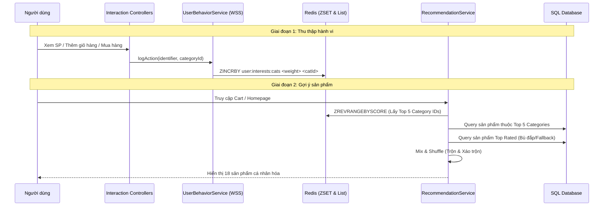
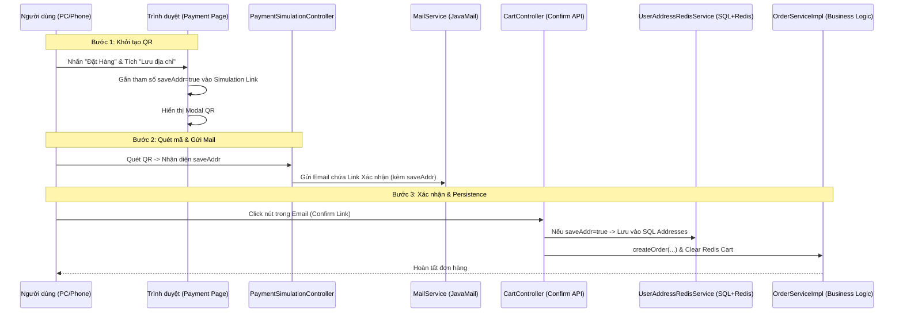

# S-Mall: Luồng Chạy Tính Năng (Feature Flow Documentation)

Tài liệu này mô tả các luồng xử lý kỹ thuật cho các tính năng chính của dự án S-Mall.

---

## 1. Hệ thống Gợi ý Cá nhân hóa (AI Recommendation Engine)

Hệ thống sử dụng mô hình **Hybrid Recommendation** kết hợp hành vi người dùng thời gian thực và dữ liệu phổ biến.

### Sơ đồ Luồng (Sequence Diagram)

### Trọng số Điểm tiềm năng (Weighted Scoring)
| Hành động | Trọng số | Ghi chú |
| :--- | :--- | :--- |
| Xem chi tiết (View) | +1 | Quan tâm mức độ thấp |
| Tìm kiếm (Search) | +2 | Có chủ đích tìm kiếm |
| Thêm vào giỏ (Cart) | +5 | Quan tâm mức độ cao |
| Mua hàng (Purchase) | +10 | Chuyển đổi thành công |

---

## 2. Hệ thống Lưu trữ Lai (Hybrid Persistence: SQL + Redis)

Hệ thống kết hợp sức mạnh của Redis (Tốc độ) và SQL (Bền bỉ) để đảm bảo dữ liệu không bao giờ bị mất ngay cả khi server bảo trì hoặc RAM bị xóa.

### Quy trình "Double-Write" (Ghi song song):
1.  **Thêm vào giỏ**: Hệ thống đồng thời lưu vào Redis (để lấy nhanh) và bảng `cart_items` trong SQL (để lưu trữ lâu dài).
2.  **Lưu địa chỉ**: Khi người dùng tích chọn "Lưu địa chỉ", thông tin sẽ được nạp vào Redis và bảng `addresses` (như một bản ghi lịch sử).

### Quản lý Vòng đời Dữ liệu (Lifecycle Management):
-   **Khi Đăng nhập (Sync on Login)**: `CustomAuthenticationSuccessHandler` kích hoạt lệnh nạp dữ liệu từ SQL lên Redis. Đảm bảo người dùng luôn thấy giỏ hàng của mình dù đổi thiết bị.
-   **Khi Đăng xuất (Purge on Logout)**: `CustomLogoutHandler` xóa sạch dữ liệu người dùng trên Redis để giải phóng RAM, nhưng vẫn giữ nguyên bản gốc trong SQL.

---

## 3. Luồng Quản lý Địa chỉ & Lịch sử Giao hàng

Hệ thống hỗ trợ lưu nhiều địa chỉ và cho phép người dùng chọn lại các địa chỉ đã từng sử dụng.

### Quy trình kỹ thuật:
1.  **Lưu trữ**: Địa chỉ được lưu vào bảng `addresses` (liên kết ManyToOne với User). Cột `address` trong `user_profiles` được giữ làm địa chỉ mặc định/gần nhất.
2.  **Truy xuất**: Tại trang thanh toán, hệ thống truy vấn tất cả địa chỉ cũ từ SQL và hiển thị thành danh sách gợi ý.
3.  **Tương tác**: Người dùng click vào địa chỉ gợi ý -> JavaScript tự động điền vào ô nhập liệu (Textarea).

---

## 4. Luồng Bảo mật & Chống Brute Force

Đảm bảo an toàn cho tài khoản người dùng thông qua Redis.

### Quy trình:
1.  **Theo dõi**: Mỗi lần login sai, tăng giá trị đếm tại `login:attempts:{username}` trong Redis.
2.  **Khóa (Lock)**: Nếu đếm đạt 5 lần, đặt TTL cho key là 30 phút.
3.  **Hành động**: 
    - Chặn mọi yêu cầu login tiếp theo trong thời gian khóa.
    - Gửi email cảnh báo bảo mật cho người dùng.
    - Hiển thị đồng hồ đếm ngược thời gian mở khóa trên giao diện.

---

## 5. Mô phỏng Thanh toán QR & Xác nhận Đơn hàng (Simulated QR Payment)

Hệ thống cung cấp quy trình thanh toán QR giả lập chuyên nghiệp, tích hợp đồng bộ dữ liệu địa chỉ.

### Sơ đồ Luồng (Sequence Diagram)

### Các công nghệ & Giải pháp áp dụng:
1.  **Auto IP Detection**: Sử dụng `DatagramSocket` trong Java để tự động tìm IP nội bộ, giúp điện thoại quét được mã QR mà không cần cấu hình thủ công.
2.  **Idempotency (Tính nhất quán)**: Xử lý trường hợp người dùng nhấn link xác nhận nhiều lần mà không gây lỗi "Trống giỏ hàng".
3.  **Real-time Polling**: Trình duyệt tự động thăm dò trạng thái đơn hàng để đóng Modal QR ngay khi người dùng xác nhận trên thiết bị khác.
4.  **Seamless Experience**: Tab xác nhận từ Email tự động hiển thị hướng dẫn đóng tab để tập trung trải nghiệm vào Tab chính.
